### 1. flowchart（含 @{shape} 新形状）
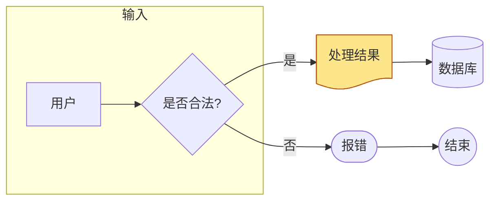
```mermaid
flowchart LR
    subgraph 输入
        A["用户"] --> B@{ shape: diamond, label: "是否合法?" }
    end
    B -->|是| C@{ shape: doc, label: "处理结果" }
    B -->|否| D@{ shape: stadium, label: "报错" }
    C --> E[(数据库)]
    D --> F((结束))
    style C fill:#fde68a,stroke:#b45309
```

### 2. sequenceDiagram
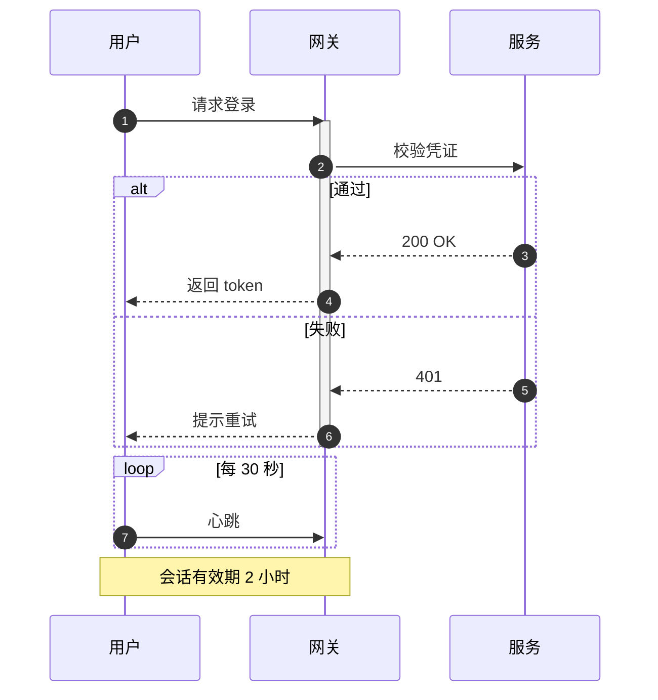
```mermaid
sequenceDiagram
    autonumber
    participant U as 用户
    participant G as 网关
    participant S as 服务
    U->>G: 请求登录
    activate G
    G->>S: 校验凭证
    alt 通过
        S-->>G: 200 OK
        G-->>U: 返回 token
    else 失败
        S-->>G: 401
        G-->>U: 提示重试
    end
    deactivate G
    loop 每 30 秒
        U->>G: 心跳
    end
    Note over U,G: 会话有效期 2 小时
```

### 3. classDiagram
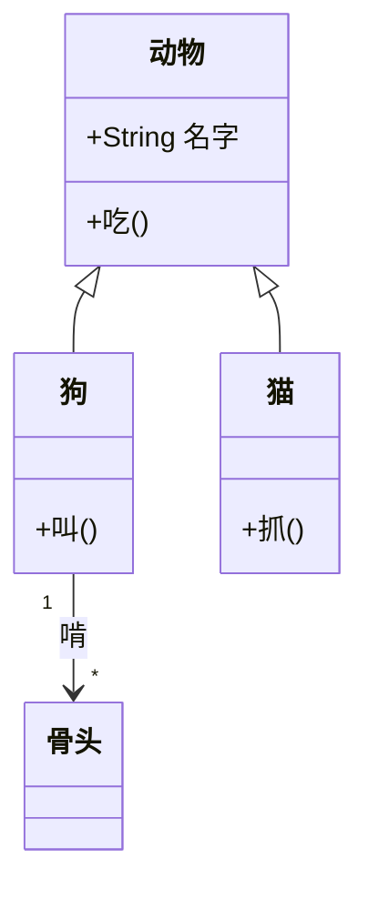
```mermaid
classDiagram
    class 动物 {
        +String 名字
        +吃()
    }
    class 狗 {
        +叫()
    }
    class 猫 {
        +抓()
    }
    动物 <|-- 狗
    动物 <|-- 猫
    狗 "1" --> "*" 骨头 : 啃
```

### 4. stateDiagram-v2（含复合状态）
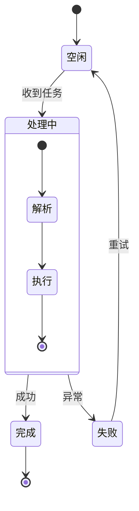
```mermaid
stateDiagram-v2
    [*] --> 空闲
    state 处理中 {
        [*] --> 解析
        解析 --> 执行
        执行 --> [*]
    }
    空闲 --> 处理中: 收到任务
    处理中 --> 完成: 成功
    处理中 --> 失败: 异常
    失败 --> 空闲: 重试
    完成 --> [*]
```

### 5. erDiagram
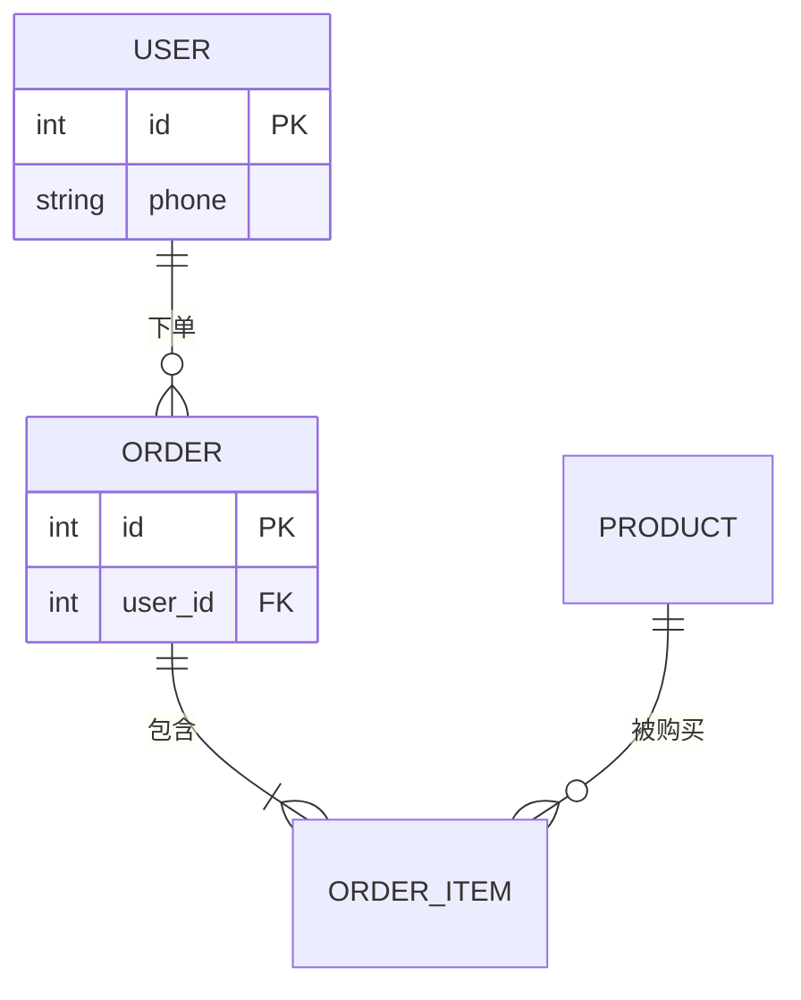
```mermaid
erDiagram
    USER ||--o{ ORDER : 下单
    ORDER ||--|{ ORDER_ITEM : 包含
    PRODUCT ||--o{ ORDER_ITEM : 被购买
    USER {
        int id PK
        string phone
    }
    ORDER {
        int id PK
        int user_id FK
    }
```

### 6. journey
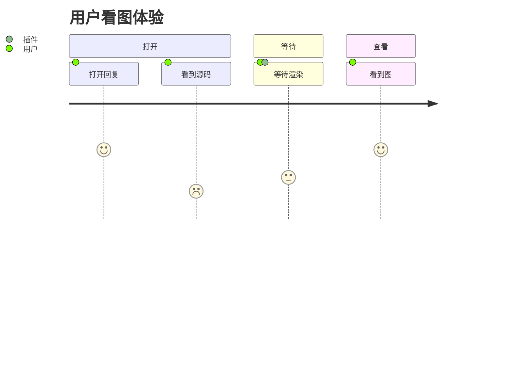
```mermaid
journey
    title 用户看图体验
    section 打开
        打开回复: 5: 用户
        看到源码: 2: 用户
    section 等待
        等待渲染: 3: 用户, 插件
    section 查看
        看到图: 5: 用户
```

### 7. gantt
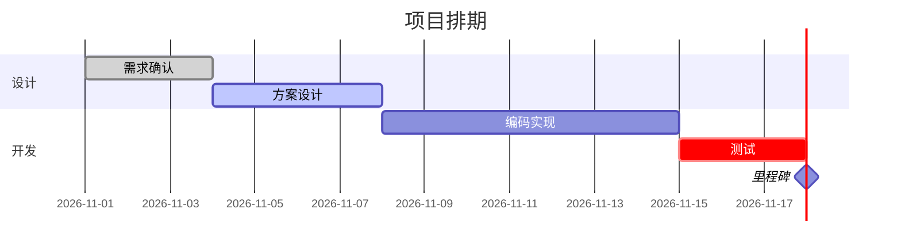
```mermaid
gantt
    title 项目排期
    dateFormat YYYY-MM-DD
    section 设计
    需求确认     :done, d1, 2026-11-01, 3d
    方案设计     :active, d2, after d1, 4d
    section 开发
    编码实现     :dev, after d2, 7d
    测试         :crit, test, after dev, 3d
    里程碑       :milestone, m1, after test, 0d
```

### 8. pie
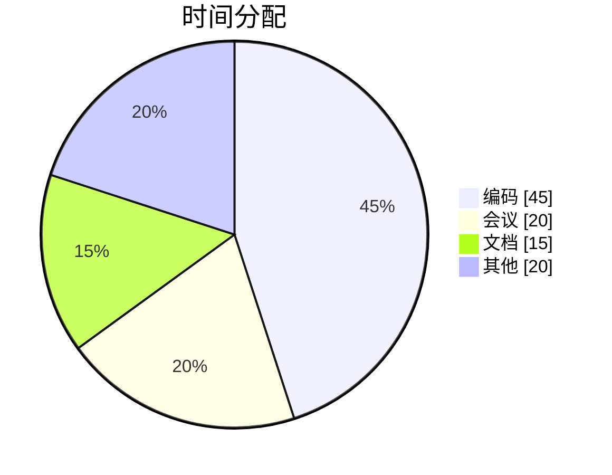
```mermaid
pie showData
    title 时间分配
    "编码" : 45
    "会议" : 20
    "文档" : 15
    "其他" : 20
```

### 9. quadrantChart
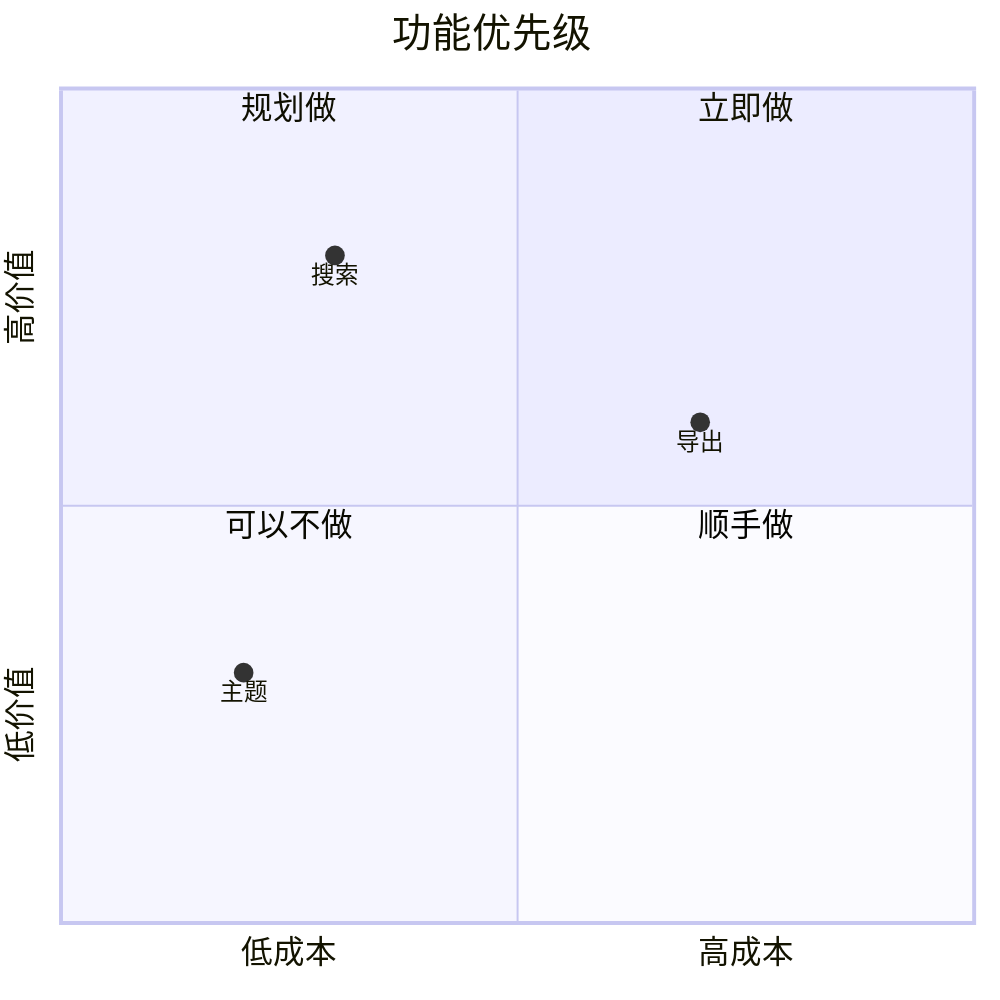
```mermaid
quadrantChart
    title 功能优先级
    x-axis 低成本 --> 高成本
    y-axis 低价值 --> 高价值
    quadrant-1 立即做
    quadrant-2 规划做
    quadrant-3 可以不做
    quadrant-4 顺手做
    搜索: [0.3, 0.8]
    导出: [0.7, 0.6]
    主题: [0.2, 0.3]
```

### 10. requirementDiagram
```mermaid
requirementDiagram
    requirement 登录需求 {
        id: 1
        text: "用户能用手机号登录"
        risk: high
        verifymethod: test
    }
    element 登录页 {
        type: ui
    }
    登录页 - satisfies -> 登录需求
```

### 11. gitGraph
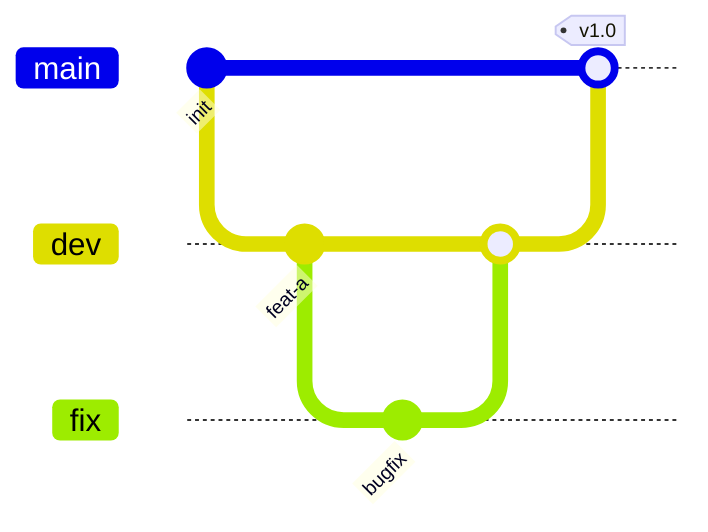
```mermaid
gitGraph
    commit id: "init"
    branch dev
    checkout dev
    commit id: "feat-a"
    branch fix
    commit id: "bugfix"
    checkout dev
    merge fix
    checkout main
    merge dev tag: "v1.0"
```

### 12. C4Context
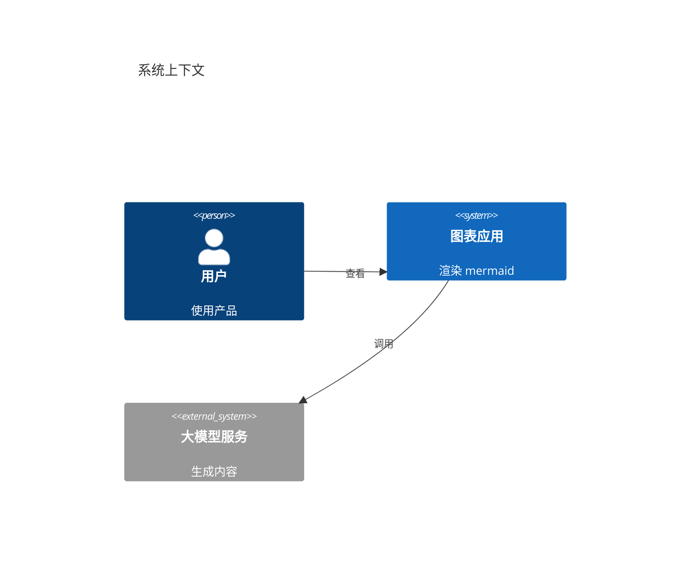
```mermaid
C4Context
    title 系统上下文
    Person(user, "用户", "使用产品")
    System(app, "图表应用", "渲染 mermaid")
    System_Ext(llm, "大模型服务", "生成内容")
    Rel(user, app, "查看")
    Rel(app, llm, "调用")
```

### 13. C4Container
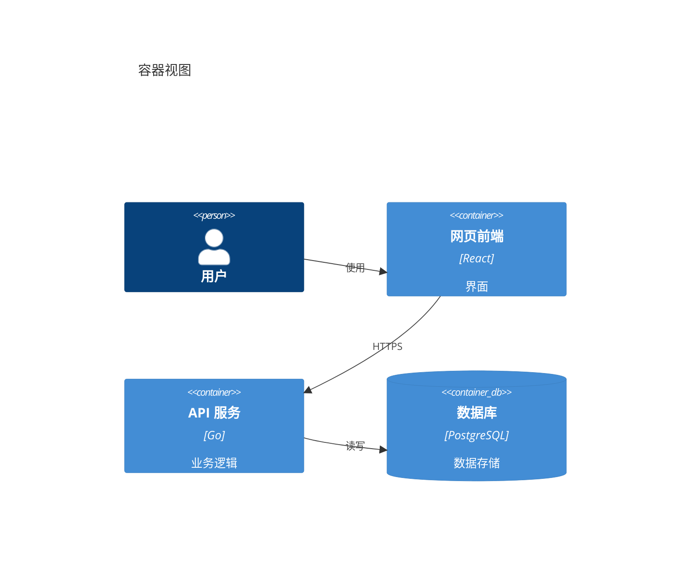
```mermaid
C4Container
    title 容器视图
    Person(user, "用户")
    Container(web, "网页前端", "React", "界面")
    Container(api, "API 服务", "Go", "业务逻辑")
    ContainerDb(db, "数据库", "PostgreSQL", "数据存储")
    Rel(user, web, "使用")
    Rel(web, api, "HTTPS")
    Rel(api, db, "读写")
```

### 14. mindmap
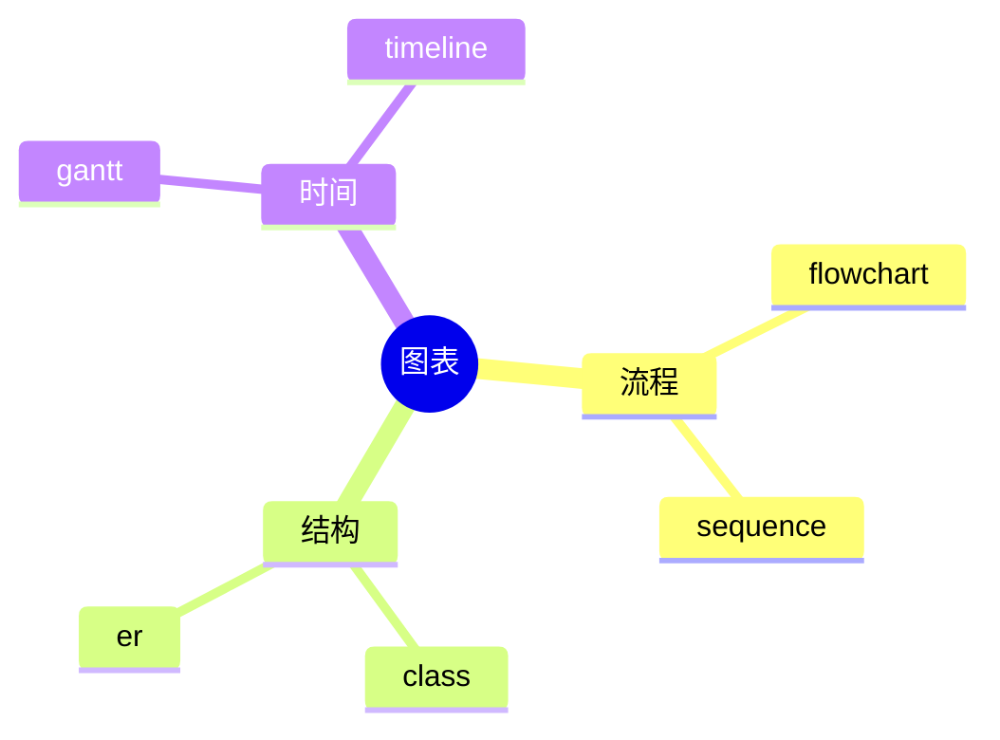
```mermaid
mindmap
  root((图表))
    流程
      flowchart
      sequence
    结构
      class
      er
    时间
      gantt
      timeline
```

### 15. timeline
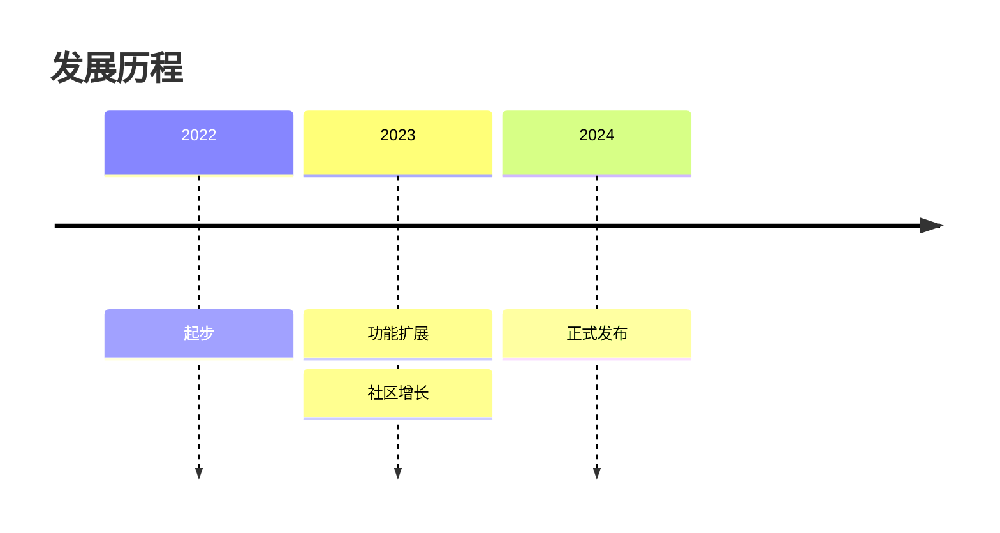
```mermaid
timeline
    title 发展历程
    2022 : 起步
    2023 : 功能扩展
         : 社区增长
    2024 : 正式发布
```

### 16. zenuml
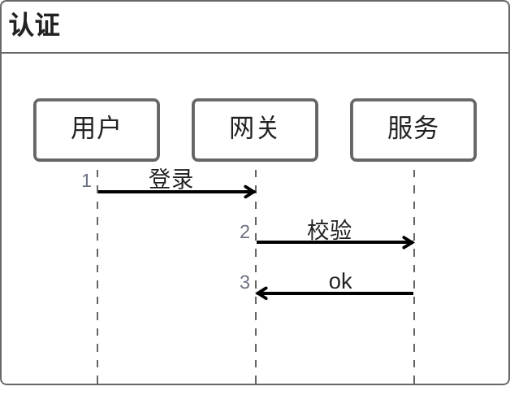
```mermaid
zenuml
    title 认证
    用户 -> 网关: 登录
    网关 -> 服务: 校验
    服务 -> 网关: ok
```

### 17. sankey-beta
```mermaid
sankey-beta
    流量,搜索,40
    流量,社交,30
    搜索,注册,25
    社交,注册,10
    注册,付费,12
```

### 18. xychart-beta（竖向柱线 + 横向）
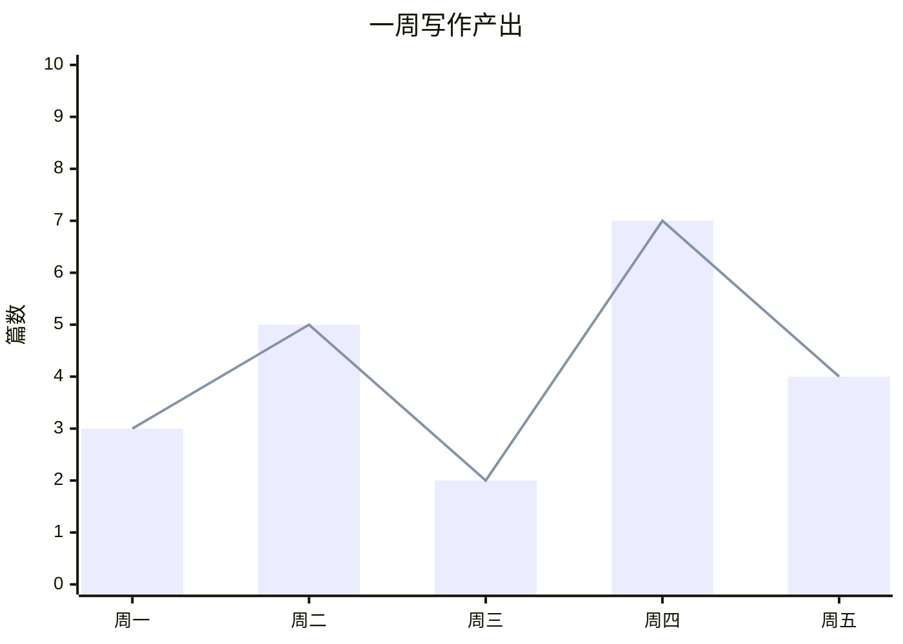
```mermaid
xychart-beta
    title "一周写作产出"
    x-axis ["周一", "周二", "周三", "周四", "周五"]
    y-axis "篇数" 0 --> 10
    bar [3, 5, 2, 7, 4]
    line [3, 5, 2, 7, 4]
```

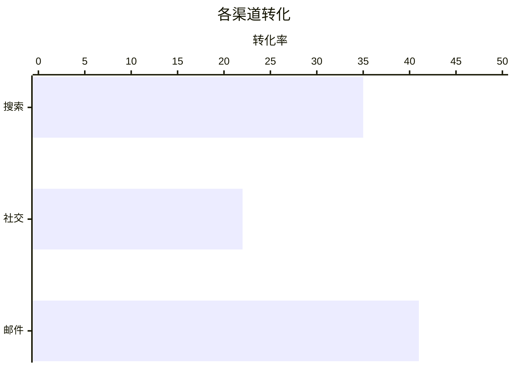
```mermaid
xychart-beta horizontal
    title "各渠道转化"
    x-axis ["搜索", "社交", "邮件"]
    y-axis "转化率" 0 --> 50
    bar [35, 22, 41]
```

### 19. block-beta
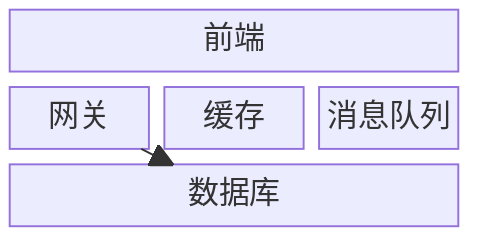
```mermaid
block-beta
    columns 3
    A["前端"]:3
    B["网关"] C["缓存"] D["消息队列"]
    E["数据库"]:3
    B --> E
```

### 20. packet-beta
```mermaid
packet-beta
    0-15: "源端口"
    16-31: "目标端口"
    32-63: "序列号"
```

### 21. kanban
```mermaid
kanban
  待办
    t1[写方案]
    t2[调研]
  进行中
    t3[编码]
  完成
    t4[发布]
```

### 22. architecture-beta
```mermaid
architecture-beta
    group api(cloud)[接口层]
    service web(internet)[网页] in api
    service server(server)[服务] in api
    service db(database)[数据库] in api
    web:R --> L:server
    server:R --> L:db
```

### 23. radar-beta
```mermaid
radar-beta
    title 能力雷达
    axis 速度, 质量, 成本, 易用
    curve A["方案A"]{80, 70, 60, 90}
    curve B["方案B"]{60, 90, 80, 50}
    max 100
```

### 24. treemap-beta
```mermaid
treemap-beta
    "总预算"
        "研发": 500
        "市场": 300
        "运营": 200
```

### 25. venn-beta
```mermaid
venn-beta
    title "技能重叠"
    set A["设计"]
    set B["编程"]
    union A,B["交互开发"]
```

### 26. info
```mermaid
info
```
